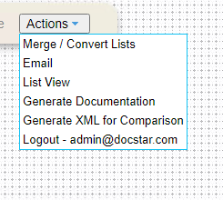
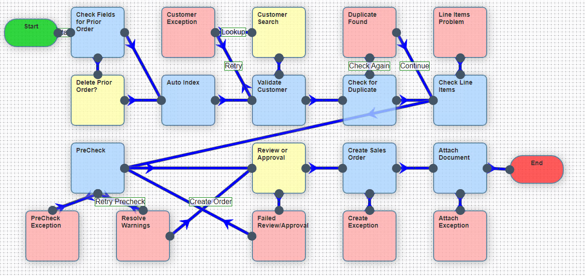
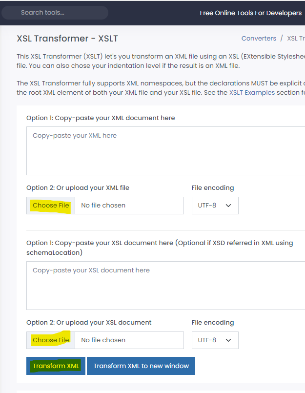
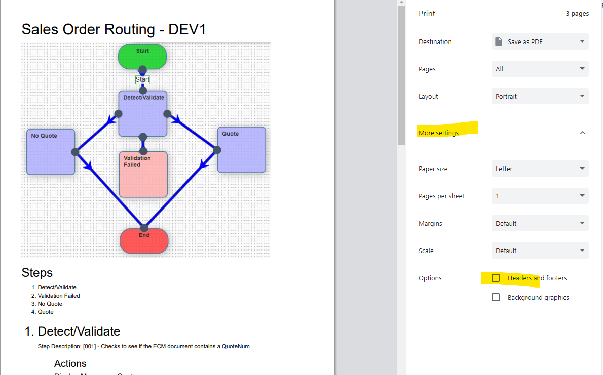

# WorkflowXSLTransformerECM
Converts ECM XML files to HTML documents with hyperlinks

## Generate the XML File

- Launch the workflow designer in ECM
- Open your workflow
  

- Under Actions, select Generate XML for Comparison
- Save the XML file
- NOTE: Before downloading the xml file from Epicor ECM add comments to every Step
- In the Step Description, start the description with a 001,002, etc. and the xsl converter will sort each step accordingly

## Take a Screenshot

- Take a full screenshot of your workflow and save the image as workflow.png

## Convert the XML to HTML

[https://www.freeformatter.com/xsl-transformer.html](https://www.freeformatter.com/xsl-transformer.html)
- Use the above Url to convert your Epicor ECM workflow xml document into a html document

- On the website linked above upload the xml file and then upload the xsl file
- The xsl file will convert the workflow xml into a html file when you hit the transform button
- After it runs, click the COPY button on the site to copy the html code
- Paste the code in notepad and save it as a .html file
- Add the workflow.png screenshot of your workflow steps in the same folder as the html and it will be displayed at the top of the html document

## Save the HTML to PDF in Chrome

- Print the html site as a pdf
- Within Chrome, when printing, there is a hide header and footer checkbox
